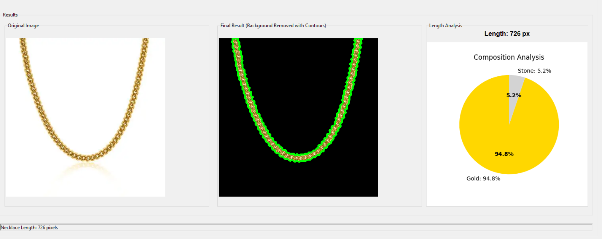
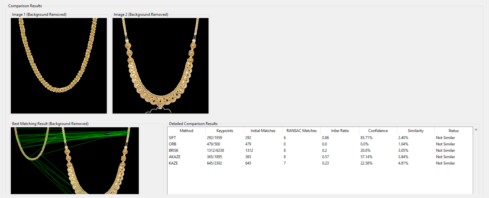

# AI-Powered Gold Loan Audit System


An **AI-powered desktop application** built using **Python, OpenCV, and Tkinter** that analyzes gold jewelry images to estimate **chain length, contour properties, and composition (gold vs stone percentage)**.

The system also includes an **image similarity module** that compares two jewelry images to detect possible duplication or fraud using multiple computer vision algorithms.

---

# Features

## Chain Analysis

* Detect gold chain contours using **advanced edge detection**
* Calculate **chain length using skeletonization**
* Identify **gold vs stone composition using HSV color segmentation**
* Generate **composition pie charts**
* Display **contour overlays for visual verification**

## Image Comparison

Compare two jewelry images using multiple algorithms:

* **SIFT**
* **ORB**
* **BRISK**
* **AKAZE**
* **KAZE**

Outputs include:

* Similarity score
* Confidence score
* Number of matched keypoints
* RANSAC match count
* Structural Similarity Index (SSIM)

## Interactive GUI

* Built with **Tkinter**
* Tab-based interface
* Embedded **Matplotlib charts**
* Real-time image visualization
* Easy image upload and analysis

---

# Application Screenshots

## Chain Analysis

Detects contours, calculates chain length, and analyzes composition.



## Chain Comparison

Compares two chains and finds matching features.



---

# Technologies Used

| Category             | Technology   |
| -------------------- | ------------ |
| Programming Language | Python       |
| GUI Framework        | Tkinter      |
| Computer Vision      | OpenCV       |
| Image Processing     | NumPy        |
| Visualization        | Matplotlib   |
| Image Similarity     | scikit-image |
| Data Handling        | Pandas       |

---

# How the System Works

### 1️⃣ Image Upload

User uploads a gold chain image.

### 2️⃣ Background Removal

Edge detection and contour filtering isolate the jewelry.

### 3️⃣ Contour Detection

Contours are drawn to identify the chain structure.

### 4️⃣ Skeletonization

The chain is skeletonized to measure its length.

### 5️⃣ Composition Detection

HSV color segmentation detects:

* Gold regions
* Stone regions

### 6️⃣ Visualization

Results are displayed as:

* Contour overlay
* Chain length measurement
* Composition pie chart

---

# Installation

## 1️⃣ Clone the Repository

```
git clone https://github.com/shibi27/ai-gold-loan-audit-system.git
cd ai-gold-loan-audit-system
```

## 2️⃣ Create Virtual Environment

### Windows

```
python -m venv venv
venv\Scripts\activate
```

### Mac/Linux

```
python3 -m venv venv
source venv/bin/activate
```

## 3️⃣ Install Dependencies

```
pip install -r requirements.txt
```

## 4️⃣ Run the Application

```
python app.py
```

---

# Project Structure

```
ai-gold-loan-audit-system
│
├── app.py
├── requirements.txt
├── README.md
│
└── assets
    ├── chain_analysis.png
    └── chain_comparison.png

```

---

# Example Output

| Parameter              | Result  |
| ---------------------- | ------- |
| Chain Length           | 1080 px |
| Gold Composition       | 78.3 %  |
| Stone Composition      | 21.7 %  |
| Best Similarity Method | SIFT    |

---

#  Future Improvements

* Real **gold weight estimation**
* **AI model for purity detection**
* Integration with **bank gold loan audit systems**
* **Fraud detection module**
* Mobile application version

---

# License

This project is licensed under the **MIT License**.
